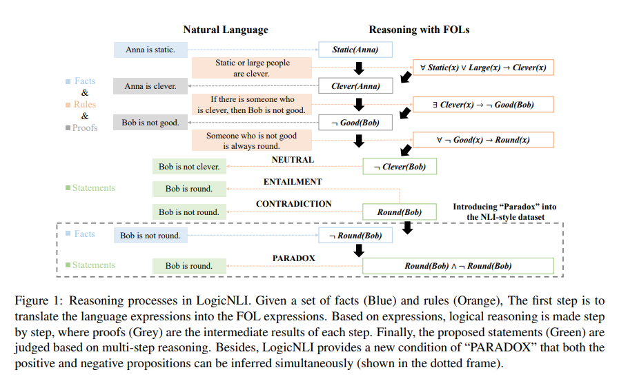

## Diagnosing the First-Order Logical Reasoning Ability Through LogicNLI

<b>2021 EMNLP</b>

<b>Jidong Tian , Yitian Li , Wenqing Chen , Liqiang Xiao, Hao He and Yaohui Jin </b>

MoE Key Lab of Artificial Intelligence, AI Institute, Shanghai Jiao Tong University 

State Key Lab of Advanced Optical Communication System and Network

Shanghai Jiao Tong University

- ## Abstract
  Recently, language models (LMs) have achieved significant performance on many NLU tasks, which has spurred widespread interest for their possible applications in the scientific and social area. However, LMs have faced much criticism of whether they are truly capable of reasoning in NLU. In this work, we propose a diagnostic method for first-order logic (FOL) reasoning with a new proposed benchmark, LogicNLI. LogicNLI is an NLI-style dataset that effectively disentangles the target FOL reasoning from commonsense inference and can be used to diagnose LMs from four perspectives: accuracy, robustness, generalization, and traceability. Experiments on BERT, RoBERTa, and XLNet, have uncovered the weaknesses of these LMs on FOL reasoning, which motivates future exploration to enhance the reasoning ability.

  

- ## Conclusion
In this paper, we propose a diagnostic method to diagnose LMs’ FOL reasoning ability. This method introduces a novel proposed benchmark, LogicNLI, that disentangles the FOL reasoning from commonsense inference. Specifically, it includes four evaluations to measure the FOL reasoning ability from different perspectives. Results on three LMs show that although some LMs (RoBERTa) own a certain interpretable FOL reasoning ability, they still cannot make sensible FOL reasoning like humans. Detailed analysis motivates us to enhance specific reasoning abilities or explore new methods to make neural models understand more refined logic.  

- ## Paper
Jidong Tian, Yitian Li, Wenqing Chen, Liqiang Xiao, Hao He, and Yaohui Jin. [**Diagnosing the first-order logical reasoning ability through LogicNLI**](https://aclanthology.org/2021.emnlp-main.303/). *In Proceedings of the 2021 Conference on Empirical Methods in Natural Language Processing*, pages 3738–3747, Online and Punta Cana, Dominican Republic, November 2021. Association for Computational Linguistics.  

- ## Dataset
[LogicNLI_sim](http://www.baidu.com)
  

  

